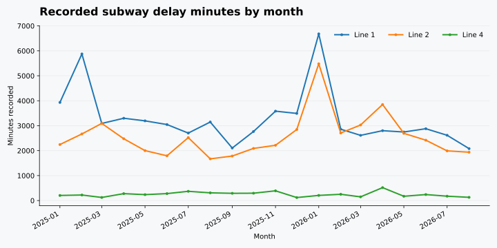
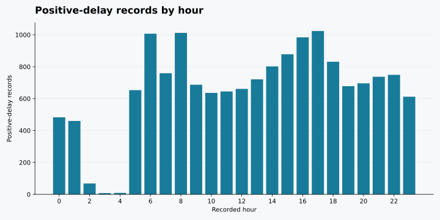

# TTC subway delays: what the incident logs show

A Toronto open-data case study, January 2025 through August 2026. This is an analysis of **recorded incidents**, not a claim about the chance a passenger is delayed. I use the City of Toronto's [TTC Subway Delay Data](https://open.toronto.ca/dataset/ttc-subway-delay-data/) and its code-description resource, clean them with Python, model them in SQLite, then use SQL to compare lines, stations, causes and months.



## What I found

- **Line 1 carries the largest recorded delay burden:** 65,506 of 121,968 minutes (53.7%) in the selected records. Line 2 has 51,508 (42.2%), and Line 4 has 4,954 (4.1%). This reflects network size and incident volume too; without scheduled train-kilometres or ridership, it is not a reliability ranking.
- **Eglinton (Line 1) and Kipling (Line 2) lead their lines** in recorded minutes among stations with at least 100 positive-delay records: 3,998 and 3,457 minutes respectively. This is where the incident was recorded, not necessarily every place affected downstream.
- **The largest coded reason by total minutes is SUDP, "disorderly patron"**: 12,103 minutes across 1,916 positive-delay records. "Unauthorized at track level" has a higher average per positive record: 12.0 minutes, versus 6.3 for SUDP. There are 1,493 incident records whose codes do not match the published reference table, so cause labels are not complete.
- **January 2026 is unusually high** at 12,366 minutes, versus 6,381 in January 2025. An apparent weather association is plausible from the codes but cannot be proved from this log alone. The month includes a few very large incidents; it should not be taken as a seasonality estimate from just two winters.
- **Peak hours (07:00-09:59 and 16:00-18:59) have 5,297 positive-delay records**, compared with 10,503 across all other hours. The peak slice covers six hours, not 18, and service levels differ. The SQL also reports the share of logged incidents with positive minutes, but that is not the chance of a delay on a trip.



## Method

1. Download the two source CSVs and preserve their original `_id` values in `data/`. The analyzed source snapshot was retrieved **September 25, 2026**. A SHA-256 of each download prints when the build runs. The analysis has an inclusive cutoff at **August 31, 2026**, so a later feed update will not silently add September records.
2. Parse dates, incident hours and numeric delay/gap fields. Standardize line labels only for `YU` (Line 1), `BD` (Line 2), and `SHP` (Line 4). Keep zero-minute records in the incident table, but use positive-delay records when ranking incidents by duration. Exclude 811 rows with missing, combined or off-network line labels from line-level analysis rather than allocating them to a line by guesswork. Preserve their audit count.
3. Create an `incidents` fact table and a `delay_codes` lookup table in SQLite. SQL joins the lookup, uses CTEs for grouped summaries, and window functions for within-line ranks and same-month year-over-year comparison. `sql/analysis.sql` holds all six queries; `data/results.md` holds their actual output.
4. Plot monthly delay minutes by line and positive records by hour. Station names are left as reported: aliasing them without a maintained station map could merge different operational locations. There are 68 rows that look alike across several fields, but have distinct source IDs, so I did not drop them as duplicates.

Run locally with Python 3.10+:

```bash
python -m venv .venv
source .venv/bin/activate
pip install -r requirements.txt
python src/build.py                 # download on first run, then reuse cached CSVs
python -m pytest -q                 # optional, after installing pytest
python src/build.py --refresh       # fetch latest; result may differ as source updates
```

The SQLite database is generated at `data/ttc_analysis.sqlite` and ignored by Git. Raw CSV files are downloaded on the first run and cached locally but are not committed to this repo; a live connection to the City resource is needed on that first run. The cutoff keeps newer rows out, but the publisher may revise old rows. The result tables and charts in this repo are from the September 25 snapshot; publisher revisions may change a future run. Re-run the SQL to update them. The current SQL uses SQLite, not an enterprise warehouse; adapting it to PostgreSQL would require minor date/string function changes.

## Limits and follow-up

The data does not provide train trips, boardings, route mileage or station exposure. Total minutes are sums of incident-level entries, not independently measured passenger-delay minutes; concurrent incidents may overlap. Do not divide them by riders or infer causality. Recorded causes depend on operator coding, and code lookup coverage is imperfect. A stronger next version would join scheduled GTFS trips, analyze delay minutes per scheduled service-hour and test whether the January 2026 spike survives an outlier sensitivity check.

**Source and licence:** [City of Toronto TTC Subway Delay Data](https://open.toronto.ca/dataset/ttc-subway-delay-data/), specifically the [2025-onward CSV](https://ckan0.cf.opendata.inter.prod-toronto.ca/dataset/996cfe8d-fb35-40ce-b569-698d51fc683b/resource/0b6e5c52-e993-46d6-8d74-8602ee224457/download/ttc-subway-delay-data-since-2025.csv) and [code descriptions CSV](https://ckan0.cf.opendata.inter.prod-toronto.ca/dataset/996cfe8d-fb35-40ce-b569-698d51fc683b/resource/b2d8f5e0-0997-46b5-8abd-caa685a0290b/download/code-descriptions.csv). Contains information licensed under the [Open Government Licence - Toronto](https://open.toronto.ca/open-data-licence/). This is an independent analysis, not an official TTC or City of Toronto report.
